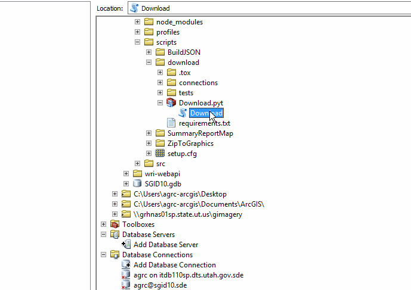

# Download GPService

## Development

1. Symlink the pyt to py because it's a python file.
    `mklink /h Download.py Download.pyt` or `ln -s Download.pyt Download.py`
1. Install the test runner
    `pip install tox`
1. Run the tests
    `tox`

## Installation
Update `secrets.py` based on `secrets.sample.py`

Update line 88 `in Download.pyt`
```
self.db = self._get_db('configuration')
```
with `local`, `dev`, `at`, `prod` and exectute.

```
Service name: WRI/Toolbox

add it as a result

Asynchronous

Message level: Error
```


